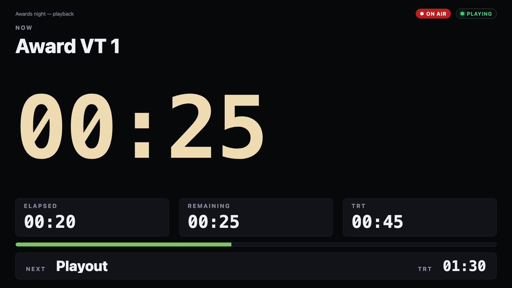
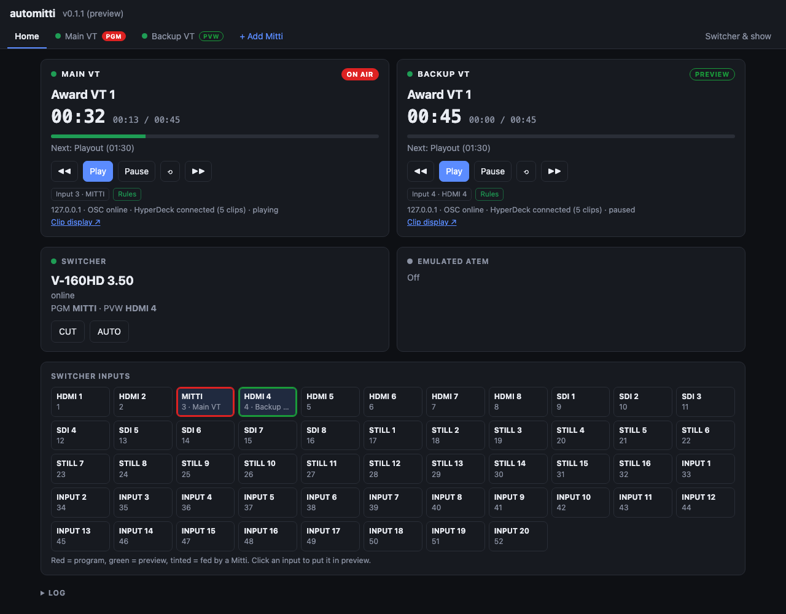

# automitti (preview)

> **AI-assisted project.** This codebase was created with [Claude](https://claude.com/claude-code)
> (Anthropic), directed and reviewed by a human author. It has run against a real Mitti
> 2.8.18 and Blackmagic's own Switcher SDK, but the switchers only against simulators — see
> [What has been verified](#what-has-been-verified) before relying on it for a show.
>
> **Preview.** v0.1.1 is a preview release: complete enough to try, not yet proven on a real
> V-160HD or Pulse 4K.

A menu-bar app that puts [Mitti](https://imimot.com/mitti/) on switchers Mitti doesn't
know about, such as a **Roland V-160HD**, an **Analog Way Pulse 4K / Midra 4K**, an older
**Analog Way Midra** (Pulse², Eikos², QuickVu…) or a **LiveCore** (Ascender, NeXtage,
SmartMatriX Ultra). They drive Mitti the way an ATEM does. automitti also:

- runs **several Mittis at once** on the one switcher — main and backup, or one per
  content type — each on its own input, with a tab of its own and a home page that shows
  them all together;
- sends each Mitti's OSC feedback to **several destinations at once**, where Mitti has only one;
- serves a **clip display page** per Mitti with the current and next clip, their TRTs, and
  the current clip's elapsed and remaining time.



*The clip display at `/display`, fed by the bundled Mitti simulator. The countdown goes amber
under 30 s and red under 10 s, and the ON AIR chip is the switcher's tally for Mitti's input.*

```
                        ┌──────────────── automitti ────────────────┐
 V-160HD  ◀─ TCP 8023 ─▶│ switcher driver ─┬─▶ emulated ATEM (UDP 9910) ◀──── Mitti's ATEM integration
 Pulse 4K ◀─ AWJ 10606 ▶│   (tally, takes) ├─▶ NDI tally receiver ─────────▶ Mitti's NDI integration
 LiveCore ◀─ TCP 10500 ▶│                  │
 Midra    ◀─ TCP 10500 ▶│                  └─▶ rules ── OSC / HyperDeck ──▶ Mitti (direct control)
                        │                                                  │
 Companion, Stream Deck ◀── OSC relay ◀── Mitti OSC feedback (UDP 51010) ◀─┘
 any browser ◀── /display (clip clock), / (control + settings)
                        └────────────────────────────────────────────┘
```

Not affiliated with or endorsed by imimot (Mitti), Roland, Analog Way, Blackmagic Design or
Vizrt (NDI). Their names are used only to say what this works with.

<!-- downloads:start -->

## Download

**[v0.1.1](https://github.com/stoatworks-labs/automitti/releases/tag/v0.1.1)** — prebuilt for macOS. Pick your platform:

<details>
<summary><b>macOS</b> — Universal (Apple Silicon + Intel)</summary>

| Build | Download | Size |
| --- | --- | --- |
| Universal (Apple Silicon + Intel) · .dmg disk image | [`automitti-0.1.1-macos-universal.dmg`](https://github.com/stoatworks-labs/automitti/releases/download/v0.1.1/automitti-0.1.1-macos-universal.dmg) | 83 MB |

</details>

All builds, checksums and release notes: [github.com/stoatworks-labs/automitti/releases](https://github.com/stoatworks-labs/automitti/releases).

macOS builds are signed and notarised by Apple, so they open normally — no Gatekeeper warning and no quarantine step.

<!-- downloads:end -->

## Four ways to put Mitti on the switcher

Pick **one** per Mitti. They are alternatives, and running two at once makes both act on
every take. With several Mittis, each can use a different one.

| Mode | Mitti is set to | What automitti does |
|---|---|---|
| **ATEM** | Integrations → ATEM → *automitti* | Emulates an ATEM whose inputs are the real switcher's inputs. Program, preview and tally follow the real switcher. When Mitti does "cut/auto to input" (Pause-at-End), the take happens on the real switcher. Every one of Mitti's own ATEM options works unchanged. |
| **NDI** | Integrations → NDI | Joins Mitti's NDI output as a *metadata-only* receiver (no video crosses the network), and reports it on program or preview from the real switcher's tally. |
| **OSC rules** | nothing (OSC on) | automitti runs Mitti's ATEM behaviour from its own side: play on program; on preview, rewind; taken off, pause / rewind / load next; cue ends, CUT / AUTO, optionally *n* seconds early. |
| **HyperDeck rules** | HyperDeck control on | The same rules, sent over Mitti's HyperDeck emulation. |

"On air" includes transitions. On a layer switcher (Pulse 4K) an input is on program while it
is a source of any fitted layer in a screen's program buffer. **During a take both buffers
count**, so a clip rolls as the mix starts, not after it.



*The control page's home tab, against two Mitti simulators and the V-160HD simulator.*

## Several Mittis

Each Mitti is a **device** in automitti. Add one with **+ Add Mitti** in the tab bar; each
gets a tab of its own. All of them share the one switcher and the one emulated ATEM.

- **Home** shows every Mitti together: its clip, countdown, next clip, tally, which input it
  is on, and which of the four modes is driving it. Below are the switcher and its inputs,
  each input marked with the Mitti it carries.
- **A Mitti's tab** has its address, its switcher input, where its feedback is relayed, its
  NDI tally, its rules and its clip display link. Remove a Mitti from the foot of its tab.
- **Switcher & show** has the switcher, the emulated ATEM, the network and the clip display
  colours, which every Mitti shares.

Each Mitti needs its **own feedback port**. A new one is given the next port after the
highest in use (51010, 51011…), and appears in Mitti's *Feedback To* list as
`automitti-51011`. Two Mittis set to the same port are flagged on both of their cards.

**Every Mitti can use the one emulated ATEM** at the same time, as several Mittis can share a
real ATEM. In each Mitti, choose *automitti* under ATEM and pick the input that Mitti is on.

**Over HTTP**, `POST /api/player` takes `"device"`: a Mitti's id (from its tab's address,
`#/device/<id>`) or its name, in any case. Without it, the request goes to the first Mitti,
as it did before. `/api/mitti` is the same.

Settings from v0.1.x carry across as the first device, named after the old clip display title.

## Switchers

| | Transport | Notes |
|---|---|---|
| **Roland V-160HD** | TCP 8023, network password | Tally is **pushed** by the unit (TALLY AUTO SEND). The unit allows **one** LAN client, so RCS over LAN cannot run at the same time. Firmware ≥ 3.3 uses `CUT;`/`ATO;`; older firmware presses the panel buttons. Labels become input names. Protocol notes: [docs/V160HD.md](docs/V160HD.md). |
| **Analog Way Pulse 4K / Midra 4K** (QuickVu, Pulse, Eikos, QuickMatrix) | AWJ, TCP 10606 | AWJ does not push changes, so the transition state is polled every 50 ms and layer sources every 400 ms. Optional screen filter (S1,S2) and the layer that preview/program selects write to. Take = `xTake`, cut = `xCut`, on every screen in scope. |
| **Analog Way LiveCore** (Ascender 16/32/48, NeXtage 08/16, SmartMatriX Ultra) | Analog Way's mnemonic protocol, TCP 10500 | A screen shows one of its preset banks, and a take changes which. An input is on air while it is a layer source in the bank on air, and in both banks during a take. **AUTO sweeps the T-bar** over the take time, because the LiveCore's own take commands stall over the protocol; CUT jumps it. Selects write the chosen layer and apply it with GROUP_UPDATE, in preset-update mode, as the Web RCS runs. Input names are the frame's labels. |
| **Analog Way Midra** (Pulse², Eikos², Saphyr, SmartMatriX², QuickMatriX, QuickVu) | the same protocol, TCP 10500 | Program and preview are fixed. An input is on air while it is a source of a live layer (not the frame layer) in program, and in preview too during a take. AUTO is the Midra's own take with each layer's transition time, **with preset-update mode turned off first**, since a take does nothing while it is on and RCS2 turns it on. CUT moves the T-bar through its middle, the only way it lands. A Midra silently refuses an input with no signal, so a select is read back and says so. The frame has no input names, so the driver takes them in its settings. A Pulse² takes **one** control session. |
| **Manual / HTTP** | none | Tally is set from the page or `POST /api/switcher`. This lets anything that can send HTTP (Companion) feed it. |

## OSC feedback to several destinations

Mitti sends feedback to exactly one address. Set it to automitti (it appears in Mitti's
*Feedback To* list as `automitti-51010` over Bonjour). automitti re-sends **every packet,
byte for byte**, to each destination you list: Companion's Mitti module on 51001, a Stream
Deck, a second machine. Only packets from the configured Mitti are relayed. Each Mitti has
its own list.

## Clip display

`http://<this machine>:8710/display?device=<id or name>`, full screen on any browser. Without
`device` it shows the first Mitti. Each Mitti's card and tab link to its own.

- current clip name, big remaining time, elapsed, TRT and a progress bar;
- next clip name and **its** TRT, which Mitti's OSC feedback doesn't carry. automitti reads
  clip durations from Mitti's HyperDeck emulation and remembers each cue's TRT once it has
  been current;
- an on-air / preview chip from the switcher's tally, amber and red countdown thresholds, and
  `frames` in the query to show frames.

Between feedback packets the clock runs locally, so it counts smoothly.

## Running it

- **Tray app:** download it from Releases, press **Start server**, and open the page.
  Settings are stored in `~/Library/Application Support/automitti/config.json`.
- **From a checkout:** `npm install && npm start`, then open <http://localhost:8710/>.
- **Without Mitti or a switcher:** `npm run sim` is a Mitti (OSC + HyperDeck),
  `npm run sim:v160hd` a V-160HD, `npm run sim:livecore` a NeXtage 16 and
  `npm run sim:midra-classic` a Pulse², the last two on TCP 10500. Run a second Mitti with
  `npm run sim -- --osc 51100 --hyperdeck 9994 --feedback 127.0.0.1:51011`.

## Adding a switcher or a player

Every switcher, and Mitti itself, is a **driver**: a folder with an `index.js` that describes
it (name, settings, how to create it) and code that speaks its protocol. The rest of automitti
(the emulated ATEM, NDI tally, the rules, the clip display, the settings page) only ever talks to
"the switcher" and "the player", so a new driver gets all of it without any change elsewhere.

- Built-in drivers are in [`drivers/`](drivers/): `switchers/v160hd`, `switchers/midra`,
  `switchers/manual` and `players/mitti`.
- Your own go in `drivers/switchers/<id>/` or `drivers/players/<id>/` inside automitti's data
  folder (`~/Library/Application Support/automitti/` on a Mac). automitti picks them up at start,
  and one with a built-in's id replaces it.
- `npm test` holds every driver to the contract, and runs it against its simulator if it has one.
  `AUTOMITTI_DRIVERS=<folder> npm test` does the same for yours.

[docs/DRIVERS.md](docs/DRIVERS.md) has the contract, a skeleton to copy, and what a QLab (or any
other player) driver would need. A driver is code that runs with automitti's access to your
network, so only install ones you trust.

## Traps worth knowing

- **Mitti connects to the first IPv4 address Bonjour gives it.** On a machine with ZeroTier
  or Tailscale that is often the VPN. Set *Network → Announce on address* to the show
  network's address. If that address disappears (the Mac moves network), automitti falls back
  to announcing on every interface and says so, and re-announces whenever the Mac's addresses
  change.
- **Mitti saves the feedback target it picks from its Bonjour list as a bare IP address.**
  Choose *automitti-51010* in Mitti's *Feedback To* list and move the Mac to another network, and
  Mitti goes on sending feedback to the old address, so automitti shows it offline. When Mitti
  and automitti are on the same Mac, set *Feedback To* to Custom, `127.0.0.1`, port `51010`;
  otherwise pick the entry again after a network change.
- **The emulated ATEM keeps one identity.** Mitti remembers an ATEM by its unique id, which
  automitti now stores in its settings (`atem.uniqueId`). In v0.1.0 it came from the Mac's host
  name, so a Mac renamed by a network change looked like a new ATEM to Mitti and had to be chosen
  again.
- **Mitti's HyperDeck emulation refuses CRLF.** A command ending in `\r\n` gets `103
  unsupported` (only `device info` gets through), so automitti sends LF. Other HyperDeck
  clients that send CRLF see nothing but errors from Mitti.
- **Mitti sends time left as a negative timecode** (`-00:00:45:00`).
- **ZeroTier owns TCP 9993**, which is the HyperDeck port. On a machine running ZeroTier,
  Mitti's HyperDeck emulation can't start, and the page says the port "answered, but not as a
  HyperDeck". You lose the next clip's TRT until it has once been current; nothing else is
  affected.
- **UDP 9910 is one per machine.** Don't run the ATEM emulation on a machine where something
  else already holds it.
- **NDI is loaded from the machine's own NDI runtime** (NDI Tools); automitti doesn't bundle
  it.

## What has been verified

On 2026-09-29, on the author's Mac:

- **Real Mitti 2.8.18:** OSC ping/pong and feedback; feedback relayed. Mitti **selected and
  connected to the emulated ATEM** by itself (over Bonjour) and reconnected after the server
  restarted, including from the packaged tray app. **An AUTO on the (simulated) V-160HD onto
  Mitti's input rolled Mitti through the emulated ATEM** as the transition began. The clip
  list with durations came over Mitti's HyperDeck emulation, and the display showed the
  current and next TRTs correctly. automitti joined **Mitti's own NDI output** as a tally
  receiver.
- **Blackmagic's Switcher SDK 10.2.1** (the code Mitti's ATEM integration runs): the SDK's
  `DeviceInfo` sample accepts the emulated ATEM. Per-input tally callbacks, `SetPreviewInput`,
  `PerformCut` and `PerformAutoTransition` work end to end through to the switcher behind it
  (`tools/sdk-check.sh --takes`). The protocol research is in [docs/ATEM.md](docs/ATEM.md).
- **NDI tally** from switcher takes, read back by an NDI SDK sender via `NDIlib_send_get_tally`,
  the same call Mitti uses.
- **Midra 4K simulator 3.2.29:** tally through AUTO (on air as the take starts), CUT, and
  preview select, and the driver's contract test (`AUTOMITTI_MIDRA_SIM`).
- **Real Mitti 2.8.19 on the Midra 4K simulator (2026-09-30):** Mitti connected to the emulated
  ATEM, an AUTO on the Midra onto Mitti's input rolled the clip half a second in, mid-transition,
  and at the end of the clip Mitti's own *Pause at End → AUTO to Preview* came back through the
  emulated ATEM as "preview 1, AUTO", and the Midra took input 1 back to program. The whole
  loop, with no rules of automitti's involved.
- **Test suite** (`npm test`): the OSC codec and relay, the V-160HD driver against its
  simulator (login, labels, pushed tally, CUT/AUTO, pre-3.3 firmware, wrong password), the
  rules end to end with both simulators, and the ATEM emulator against `atem-connection`.
- **Several Mittis, against simulators (2026-10-08):** two Mitti simulators on one V-160HD
  simulator. A cut to each one's input rolled that Mitti and only that one, and the one taken
  off paused. A Mitti was added (on the next feedback port), renamed, given an input and
  removed from the page, and its feedback port was released. The author's own v0.1.1 settings
  file became the first device with its relay list, NDI tally, rules and ATEM id intact.

- **LiveCore and Midra (2026-10-08), against simulators only:** the drivers are written from
  [openRCS](https://github.com/stoatworks-labs/openrcs), which established the protocol and its
  traps on a real NeXtage 16 and Pulse². Against simulators that play those traps back, both
  passed the contract test and their own tests (labels, preset-update mode, GROUP_UPDATE, the
  T-bar sweep, the Midra's take and cut, a refused input, the wrong family), and in the app a
  take on each rolled the right Mitti as it began.

**Not yet verified:**
- two real Mittis at once, on any switcher, and two real Mittis on one emulated ATEM;
- a real LiveCore or Midra with automitti. In particular: whether a LiveCore's T-bar sweep
  looks right at the default 1 s; whether a Midra's take is seen as it starts (automitti's own
  takes are; one from the front panel is seen only if `GCtak` shows it); whether a Midra keeps a
  program select without a further commit; and which models besides the Pulse² report what;
- a real V-160HD. It is written from Roland's documents and the Companion module, and its
  uncertain points are listed in [docs/V160HD.md](docs/V160HD.md);
- a real Pulse 4K for this code. Its paths were read off a live Pulse 4K by LivePremier Plus;
- Mitti playing on NDI tally, as opposed to receiving it;
- Windows and Linux builds.

## Layout

```
server/            the Node server the tray app runs
  core/            the driver contract, the registry, and the switcher and player hosts
  lib/             protocol code drivers share: OSC, HyperDeck, Analog Way's mnemonic
                   protocol (handed to drivers as `lib`)
  atem/            the ATEM protocol server and its bridge to the switcher
  ndi/             NDI tally via the installed runtime (koffi FFI)
  devices.js       the Mittis: each a player with its own input, relay, NDI tally and rules
  rules.js         Mitti's ATEM behaviour, run through the player driver
drivers/
  switchers/       v160hd, midra, livecore, midra-classic, manual: each index.js + driver
                   code (+ sim.mjs; livecore's plays a Midra too)
  players/mitti/   OSC link and relay, feedback model, HyperDeck clip list, sim.mjs
web/               control page (home, a tab per Mitti, switcher & show; driver settings drawn
                   from each schema), clip display
tools/             sdk-check.sh (the emulated ATEM against Blackmagic's own SDK)
launcher/          the tray app (the fleet's av-launcher shell, Tauri)
docs/              DRIVERS.md, and MITTI.md, ATEM.md, V160HD.md: the protocol research
```

<!-- attributions:start -->
This project is built on other people's work — see [ATTRIBUTIONS.md](ATTRIBUTIONS.md).
<!-- attributions:end -->
